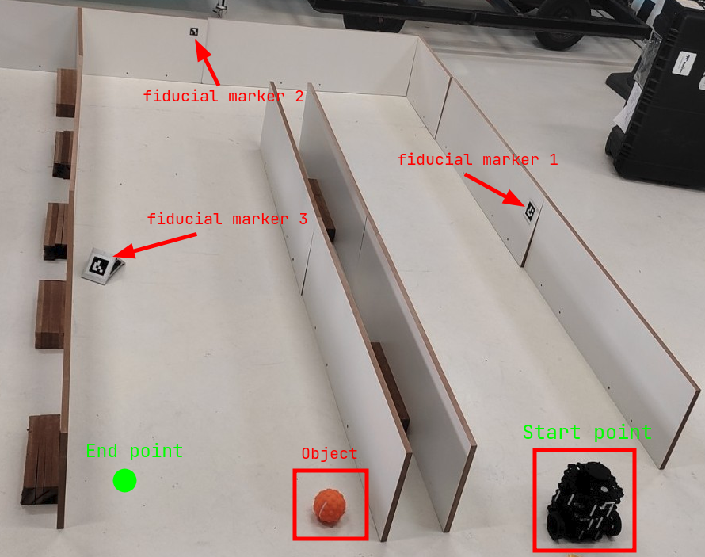

# bir_ground_challenge

This repository supports the development of the ground robotics challenge from [RASC](https://www.braziliansinrobotics.com/).

**Keywords**: Challenge, Ground-robotics, Turtlebot3

**Author**: [Anderson Lima](https://github.com/aldenpower)  
**Affiliation**: [RASC](https://www.braziliansinrobotics.com/)  
**Maintainer**: [Anderson Lima](https://github.com/aldenpower), eng.andersonfsl@gmail.com

**Sharp your spear!**

_For a good development it is suggested that you perform the following tutorials_

- [ROS2](https://docs.ros.org/en/foxy/Tutorials.html)
- [turtlebot3](https://emanual.robotis.com/docs/en/platform/turtlebot3/overview/)
- [Nav2](https://navigation.ros.org/)

## Justification

Developing skills and knowledge in navigation is very important for a researcher in the field of robotics, in view of the growth of mobile robotics applied to the theme "robots in terrestrial environment", it is necessary to develop mechanisms that solidify knowledge in a practical way. Concepts such as *SLAM, State-machine, computer vision and localization* are quite recurrent in this context, so, the **Heavy Hull** challenge proposes the systematic application of these concepts in order to strengthen future developments.

## Objective

The objective is to carry out the [mission](#heavy-hull-mission) obeying the [prerequisites](#prerequisites).

## Heavy Hull Mission

The [**Turtlebot 3**](https://emanual.robotis.com/docs/en/platform/turtlebot3/overview/) must go through a delimited [environment](#Environment) starting at the start point highlighted in the [example environment](#example-environment), being positioned with the camera facing away from the entrance. The mission environment is similar to a maze, composed of two corridors and with the 3 previously placed [fiducial markers](#aruco-fiducial-marker). The robot must go through the environment completely and reach the end point, at the end of the route (arrival at the final point) there will be an [object](#object) that must be identified.

### Environment

#### Example environment

### Object

The object to be identified is an orange ball

### ArUco fiducial marker

The markers used must be of the ArUco type

## Prerequisites

- The challenge must be performed using [ROS2](https://docs.ros.org/en/foxy/index.html)
- For autonomous navigation, ***state-machine*** must be used
- The simulation and real [environment](#environment) must be built based on the [example environment](#example-environment)
- The [**Turtlebot 3**](https://emanual.robotis.com/docs/en/platform/turtlebot3/overview/) must make the [environment](#environment) map while executing the [mission](#heavy-hull-mission)
- The [**Turtlebot 3**](https://emanual.robotis.com/docs/en/platform/turtlebot3/overview/) must use **three** [fiducial markers](#aruco-fiducial-marker) for localization

## Questions?

contact: [Anderson Lima](https://github.com/aldenpower), eng.andersonfsl@gmail.com